# Finite Element Analysis of 1D Solid Mechanics — From Scratch in Python

**Course:** Materials Simulation Practical | FAU Erlangen-Nürnberg  
**Tools:** Python · NumPy · Matplotlib

💻 [Notebook](fem_1d_elastic_bar.ipynb)

---

## Overview

From-scratch implementation of the Finite Element Method for 1D linear elasticity in Python/NumPy. The project covers the full pipeline: constitutive tensor symmetry reduction, weak-form derivation, linear shape functions and B-matrix, Newton–Cotes numerical quadrature, global stiffness assembly, Dirichlet/Neumann boundary condition enforcement via permutation-matrix reduction, and element-wise stress recovery across four loading cases.

---

## Constitutive Relations & Weak Form

Starting from the static balance of linear momentum div(σ) = −ρb, Hooke's law σ = C:ε is applied. The full symmetry analysis of the stiffness tensor C_ijkl reduces 81 independent components to 21 via minor symmetries (stress/strain symmetry) and major symmetry (strain energy density), cast in Voigt notation. The 1D weak form is derived by multiplying by a test function and integrating by parts:

$$\int_0^l EA \frac{du}{dx} \frac{d(\delta u)}{dx} \, dx = \int_0^l \rho b \, \delta u \, dx + \bar{t} A \, \delta u \Big|_{\Gamma_t}$$

---

## Shape Functions, Interpolation, and Gradient Approximation

Linear Lagrange shape functions \(N_1\) and \(N_2\) are defined over each element. Their spatial derivatives form the strain-displacement matrix \(B\), which is constant for linear 1D elements. As a result, the strain and stress recovered from the displacement field are elementwise constant.

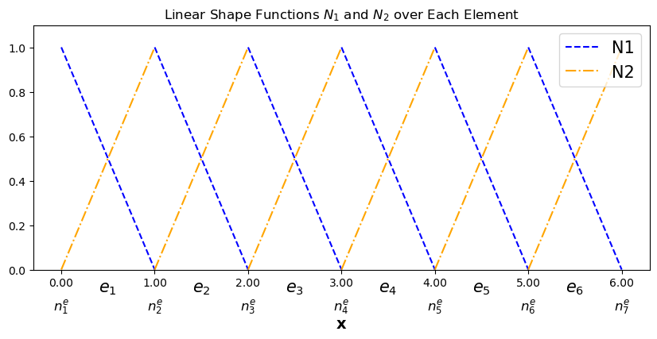

### Interpolation of the displacement field

Interpolation accuracy is tested for three functions: a linear function \(f(x)=2x+3\), a sinusoidal function \(f(x)=\sin(x)\), and a quadratic function \(f(x)=x^2\).

<table>
<tr>
<td>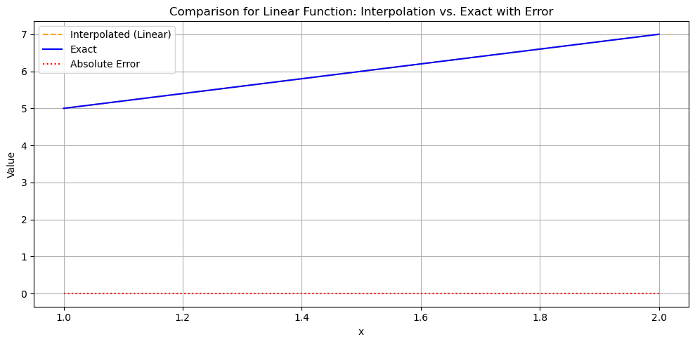</td>
<td>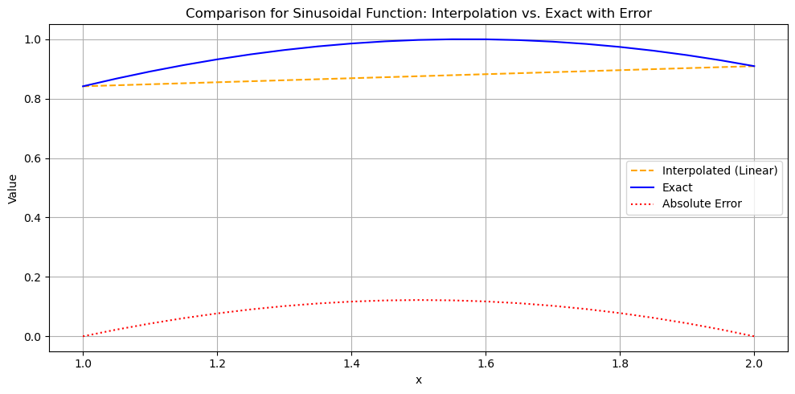</td>
<td>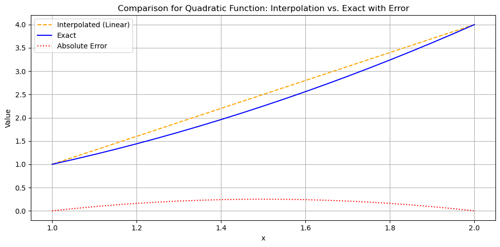</td>
</tr>
<tr>
<td align="center">Linear function</td>
<td align="center">Sinusoidal function</td>
<td align="center">Quadratic function</td>
</tr>
</table>

The linear function is reproduced exactly, while the sinusoidal and quadratic functions are only approximated, producing a bounded interpolation error.

### Approximation of the displacement gradient

The same three functions are then examined at the derivative level by comparing the exact gradient with the gradient reconstructed from the shape-function derivatives \(B = dN/dx\).

<table>
<tr>
<td>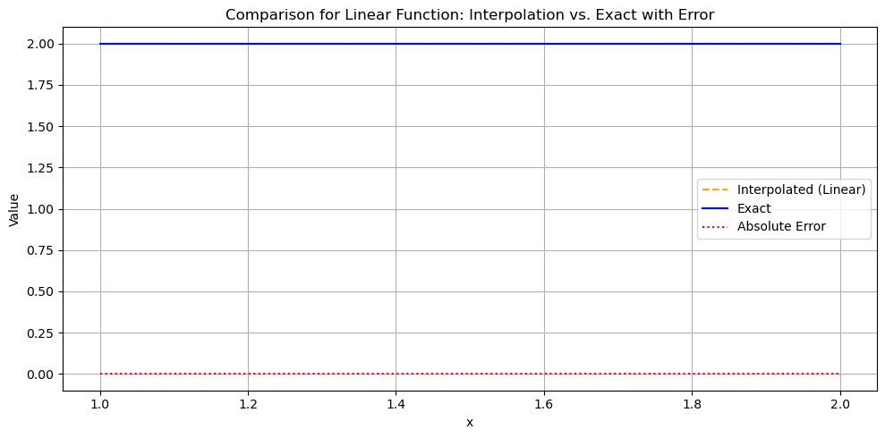</td>
<td>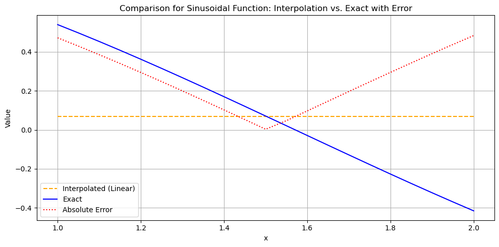</td>
<td>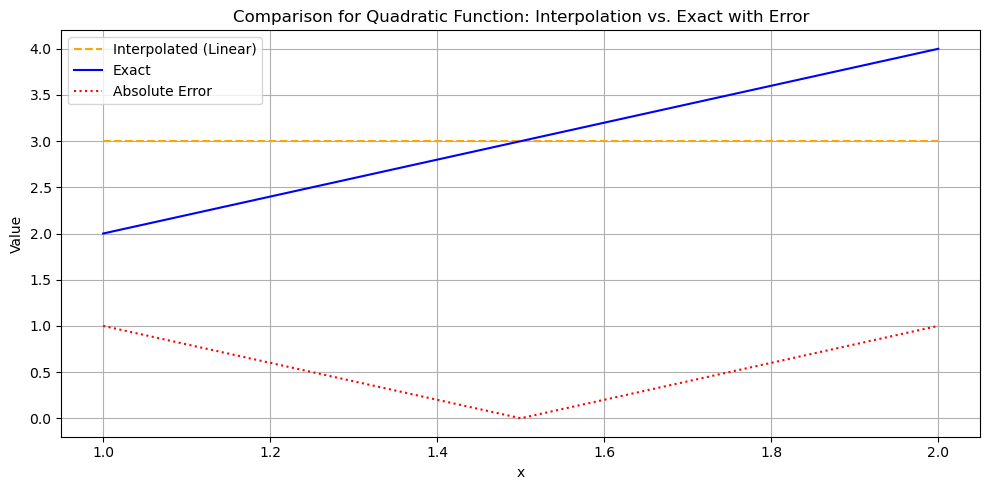</td>
</tr>
<tr>
<td align="center">Derivative of linear function</td>
<td align="center">Derivative of sinusoidal function</td>
<td align="center">Derivative of quadratic function</td>
</tr>
</table>

Because linear shape functions have constant derivatives within each element, the gradient approximation is piecewise constant. This is why the stress field recovered from linear bar elements is also piecewise constant, with jumps possible across element boundaries.

---

## Numerical Quadrature

Three Newton–Cotes rules are implemented and validated:

| Rule | Points | Exact for polynomial degree |
|---|---|---|
| Trapezoidal | 2 | ≤ 1 |
| Simpson's | 3 | ≤ 2 |
| 3/8 Rule | 4 | ≤ 3 |

The element stiffness matrix for a 1D bar (E = 210,000 N/mm², A = 25 mm², L = 50 mm) is computed via trapezoidal quadrature and verified analytically.

---

## Global Assembly & Boundary Conditions

An assembly routine maps local element stiffness matrices into the global system via node connectivity, producing the symmetric tridiagonal global stiffness matrix K. Dirichlet boundary conditions are enforced using a permutation-matrix reduction: a matrix P of shape (n−m)×n maps the full displacement vector to the free-DOF subspace, solves the reduced system K_r·d_r = f_r, and reconstructs the full solution via back-substitution.

---

## Stress Recovery & Loading Cases

Element-wise stress is recovered as σ = E·B·û on a 6-element, 7-node bar with total length L = 50 mm (E = 210,000 N/mm², A = 25 mm²). Nodes are indexed 0–6.

### Case 1 — Mixed Dirichlet–Neumann BCs (u(0) = 0, tip load F = 5 N)

<table>
<tr>
<td>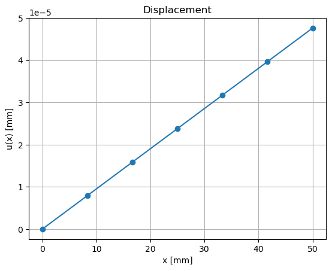</td>
<td>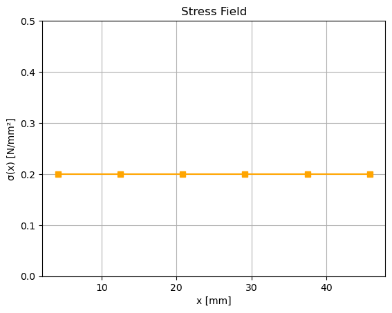</td>
</tr>
<tr>
<td align="center">Displacement</td>
<td align="center">Stress</td>
</tr>
</table>

The displacement varies linearly and the stress remains uniform at σ = 0.2 N/mm² across all elements, consistent with the analytical solution for an axially loaded bar with one fixed end and an applied end force.

### Case 2 — Double Dirichlet (u(0) = 0, u(25 mm) = 0.01 mm)

<table>
<tr>
<td>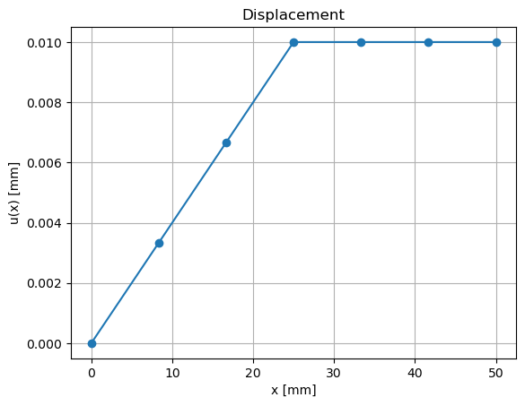</td>
<td>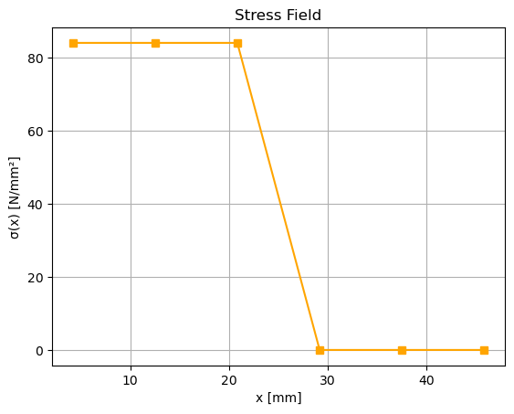</td>
</tr>
<tr>
<td align="center">Displacement</td>
<td align="center">Stress</td>
</tr>
</table>

Displacement ramps linearly to the prescribed value at x = 25 mm and plateaus thereafter. Stress is elevated in the constrained region and drops sharply in the free segment.

### Case 3 — Internal + End Load (u(0) = 0, F_node3 = 30 N, F_end = 40 N)

<table>
<tr>
<td>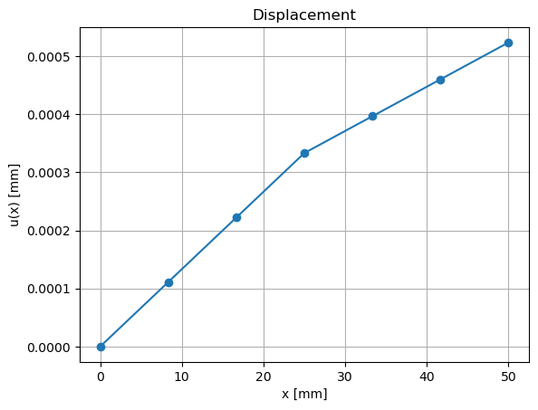</td>
<td>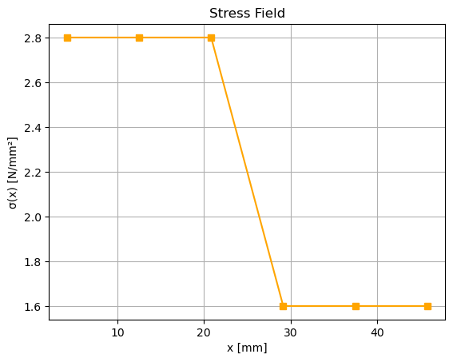</td>
</tr>
<tr>
<td align="center">Displacement</td>
<td align="center">Stress</td>
</tr>
</table>

A concentrated internal load at node 3 produces a stress jump at that location. Elements to the left carry the combined load while elements to the right carry only the end load, resulting in a piecewise-constant stress profile with a clear discontinuity.

### Case 4 — Combined BCs (u(0) = 0, u(50 mm) = 0.0015 mm, internal and end loads)

<table>
<tr>
<td>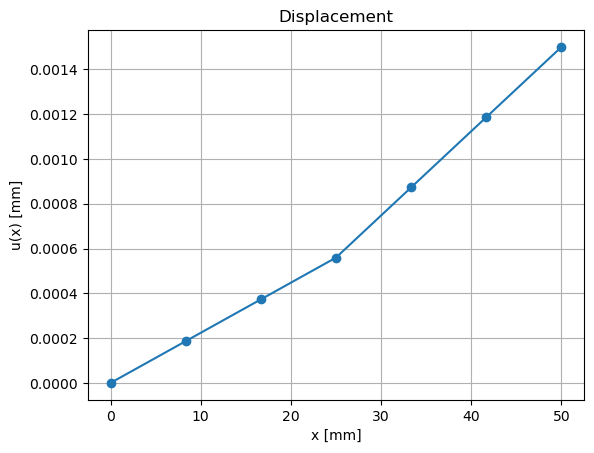</td>
<td>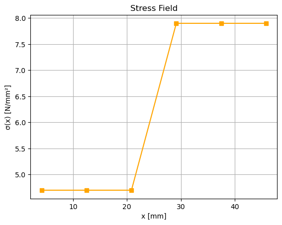</td>
</tr>
<tr>
<td align="center">Displacement</td>
<td align="center">Stress</td>
</tr>
</table>

With both ends constrained, the displacement remains continuous but changes slope across the internal load location. The stress field is piecewise constant and exhibits a clear jump at the loaded node, increasing from approximately 4.7 N/mm² on the left to 7.9 N/mm² on the right.

---

## Requirements
```bash
pip install numpy matplotlib
```

---

## Usage

Open `fem_1d_elastic_bar.ipynb` in Jupyter and run cells sequentially. All functions — shape functions, B-matrix, quadrature, assembly, BC enforcement, and stress recovery — are defined incrementally and reused across tasks.
